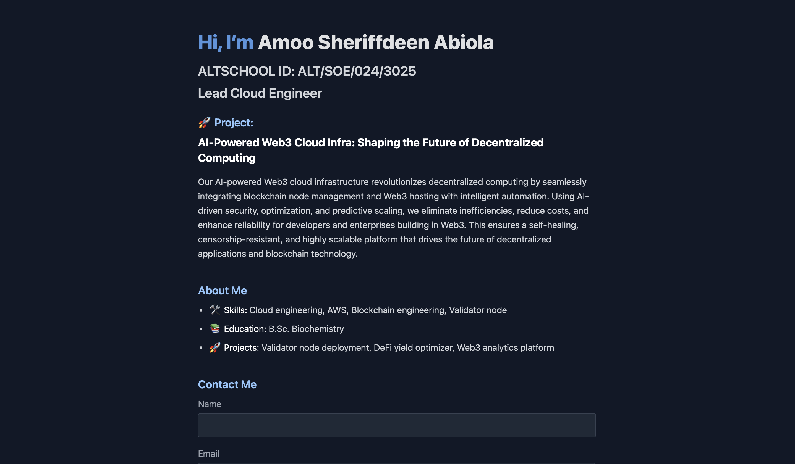

# My-examination-project
# 🚀 AI-Powered Web3 Cloud Infra

**Deployed by:** Amoo Sheriffdeen Abiola  
**Role:** Lead Cloud Engineer  
**AltSchool ID:** ALT/SOE/024/3025

---

## 🌍 Live Demo

Visit: http://sheriffdeen.xyz

Public IP: 16.171.250.138

---

## 🛠️ Tech Stack

- **Cloud Provider:** AWS EC2 (Ubuntu 22.04)
- **Web Server:** Nginx (with reverse proxy to Node.js)
- **SSL:** Let’s Encrypt (via Certbot)
- **Frontend:** TailwindCSS + HTML + CSS animations
- **Node.js** for serving the landing page

---

## ✅ Steps Followed

### 1. **Provisioned Ubuntu EC2 Instance**

- Launched an EC2 instance on AWS using Ubuntu 22.04
- Opened ports 22 (SSH), 80 (HTTP), 443 (HTTPS).
- Connected via SSH  using Termius.
  
### 2. **Installed Web Server**

- Installed Nginx.
- Installed  Node.js app + Express 
- Nginx set as a reverse proxy to the Node.js server.

### 3. **Built Dynamic Landing Page**
- Added role, project description, skills, education, and links.
- Used Tailwind CSS CDN.
- Added CSS animations using `@keyframes`.

### 4. Deployment

- Created a directory `/home/ubuntu/web-app/public` with `index.html`
- Configured Express to serve static files from `public`
- Registered domain `sheriffdeen.xyz` on Namecheap
- Pointed DNS A record to EC2 public IP
- Configured Nginx virtual host for domain

### 5. **Secured with HTTPS (Let’s Encrypt)**
- Installed Certbot:
  ```bash
  sudo apt install certbot python3-certbot-nginx

- Issued SSL certificate:
   ```bash
  sudo certbot --nginx -d sheriffdeen.xyz -d www.sheriffdeen.xyz
 
-  Configured auto-renewal:
    ```bash
   sudo certbot renew --dry-run


---

## 📸 Screenshot

 

